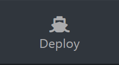
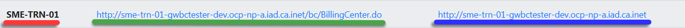
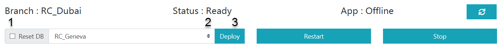
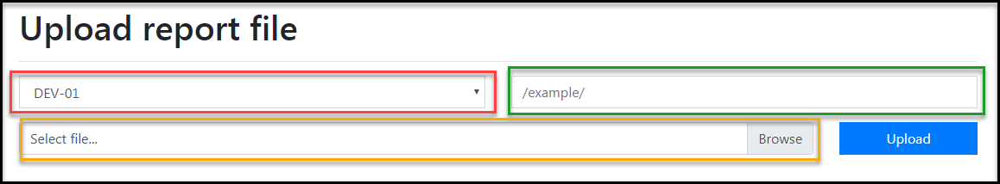
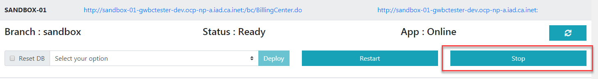
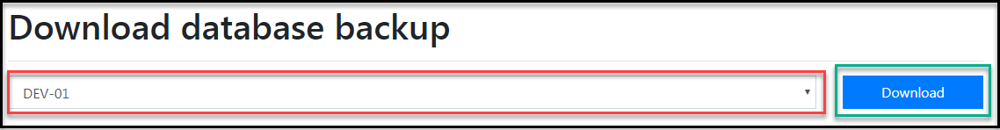
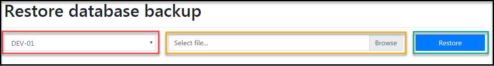
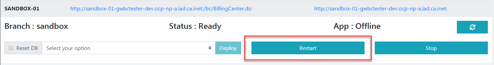

# SME Docker Documentation

## Not supported on Internet Explorer
---

This application is used to easily deploy Guidewire environment. Each user has it's own independant environment that can be used for various purposes.

## How to use the app

1. To deploy your own Guidewire environment click onto this icon :

    
2. Depending of your case choose the right tab and this will display the list of **pods** that are available.
    > A **pod** is an independant Guidewire environment that can be deploy on command. 

    Each item of the list is composed this way : SME-TRN-01 is the name of the pod, the  first URL linked to the Guidewire environment and the second is to consult the reports associated with the specified environment : 
   
   

   Click on the name of the pod, in this case SME-TRN-01 to show more details.
3. The first line in the pod menu tells some information about the pod and the second line allows to **deploy**, **restart** or **stop** a pod.
   
  To deploy an environment: 
     1. check *Reset DB*
     2. choose a branch on the dropdown menu 
     3. click the *deploy* button

## Notes
>To restart the database of an environment, re-deploy it and make sure the *Reset DB* checkbox is checked.

>When you are done with an environment please **stop** it to relocate the ressources that are dedicated to it.

>The details concerning a pod do not update on their own. To see the status of a pod before or after performing an action always press the refresh button:  

 
 

## Environments available in the app: 
> **SME environments**: Allow SME and BA to be able to test Guidewire Billing Center with any data and in any way they need without impacting any other person

> **SME-TR​N environments**: These environments are dedicated to Super Users so they can prepare for training sessions

> **Sandbox environments**: This environment contains the 'Out of the Box' version of Guidewire Billing Center for references

## Documentation for the Database Backup tool

This tool can be found here : http://billing-sme-upload-gwbctester-dev.ocp-np-a.iad.ca.inet/

The purpose of this tool is to either download the database of a Guidewire environment or to update it.

The app has 3 main tools :
   - The first is to upload a report file to the desired environment
   - The second is used to download a backup of a Guidewire Database
   - The third one is used to restore a backup database stored in local to a Guidewire environment

### Upload report file

This can be used with a **running** environment, the environment does not need to be stopped for the tool to work.

The red part is where you select the environment in which you want to upload the report
(Optional) The  green part is if you want to specify the path of the location of your upload
The  yellow part is where you specify where the file is located on you local computer.

Then, to upload to file, simply press the "Upload" button.

### Download database backup and Restore database backup

Those two tools are pretty similar to use. Both need to interact with an offline environment whichn necessarily mean that once the tool is used, the environment as to be turned on again.

1. In both cases, you need to stop the environment you want to interact with.
   > In the example, the pod used is the sandbox, but in your case use the actual pod that you want to work on.

    To stop the pod, simply press the step button, press the refresh button   until the status of the app is "App: Offline" instead of "App: Online"

2. Now you can either download or restore a database. 
   To download simply choose the environment you want and click the download button
   
  To upload simply choose once again the environment you want, select the file you want to upload from your computer and click the restore button.
   

3. Once that everything is done, you have to restart the environment that you modified. Click on the Restart button, do not check Reset DB nor select any option.
   
